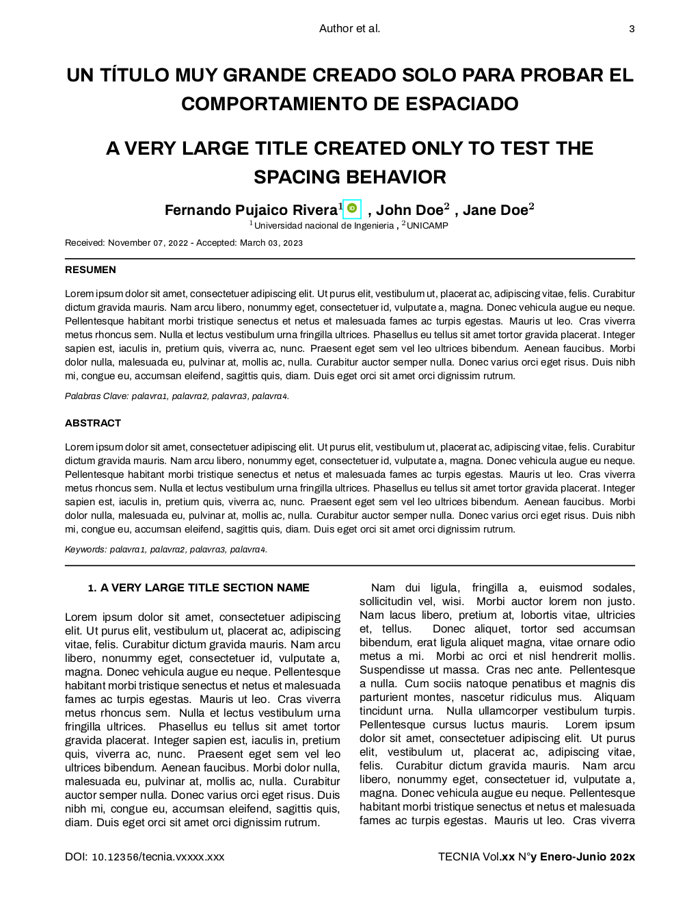

# Latex class to Tecnia journal

Creates macros in the Tecnia journal format.

## Load the class
Put the `tecnia-uni-article.cls` file in some location, by example `/path/of/file`.
To load the class use the next command in the preamble of main tex document.

	\documentclass{/path/of/file/tecnia-uni-article}

## Example
An example of using the class can be found at 
`https://github.com/trucomanx/tecnia-uni-article/tree/main/example`

